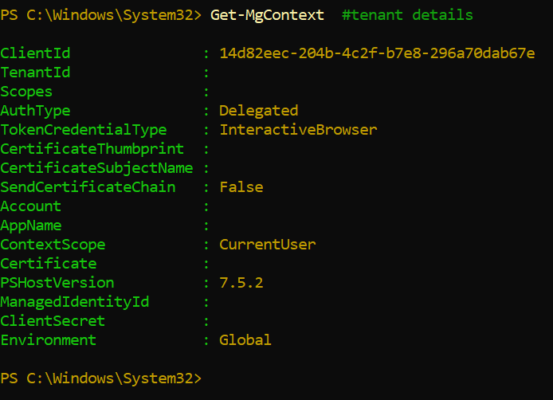

# 🔑 Entra ID Portfolio Projects

This repository contains hands-on **Identity & Access Management (IAM)** projects completed in **Microsoft Entra ID (Azure Free/Students)**.  
Each project simulates real-world IAM tasks with screenshots, exports, and case study reports.

---

# 📘 Project 1 – IAM Basics (Users, Groups, RBAC, Exports)

## Overview
Simulated a small company directory:
- Created users (Alice HR, Bob IT, Mike Finance, Marshall Dev, D_Admin)
- Organized into groups (HR, IT Support, Finance, Developers)
- Assigned RBAC role (Password Administrator for D_Admin)
- Exported users and groups to CSV via the Entra portal

## Screenshots
  
  
  
  
  
  
  

## Deliverables
- [Project1_IAM_CaseStudy.docx](Project1_IAM_CaseStudy.docx)  
- `exportUsers_*.csv`, `exportGroup_*.csv`

---

# 📘 Project 2 – App Registration & Graph Authentication

## Overview
Registered an app in Entra ID and tested integration with Microsoft Graph using Device Code Flow.  
Demonstrated authentication context and documented free-tier licensing restrictions.

## Steps
- Registered `Demo-App` in Entra ID  
- Configured delegated permission: **User.Read**  
- Signed in via Device Code Flow in PowerShell  
- Verified authentication context with `Get-MgContext`

## Screenshots
  
  
  
  
  
  
  

## Deliverables
- [Project2_AppIntegration_CaseStudy.docx](Project2_AppIntegration_CaseStudy.docx)

---

# ⚠️ Limitations (Free Tier)
- Graph API calls to retrieve user profiles or directory users return **403 Forbidden** in free/student tenants  
- Conditional Access, scoped SSPR, and Identity Protection require Azure AD Premium (P1/P2)  
- Workarounds: Portal exports + documentation  

---

# 🚀 Future Enhancements
- Automate provisioning with Microsoft Graph PowerShell (P1 tenant)  
- Enforce MFA via Conditional Access  
- Group-based licensing & Identity Protection policies  

---

👤 **Author:** Boyon Dey Shipon  
📅 **Date:** August 2025
